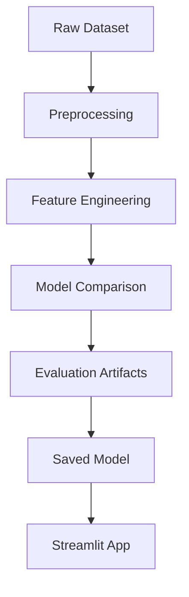

# Architecture

```mermaid
flowchart TD
    A[Raw Dataset] --> B[Preprocessing]
    B --> C[Feature Engineering]
    C --> D[Model Comparison]
    D --> E[Evaluation Artifacts]
    E --> F[Saved Model]
    F --> G[Streamlit App]
```
